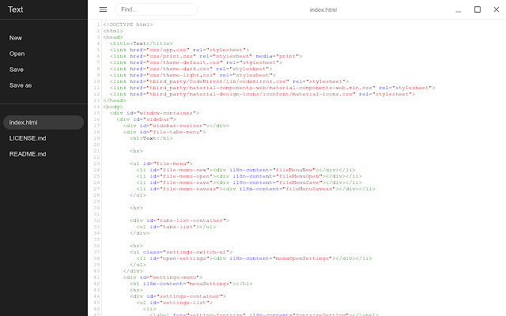
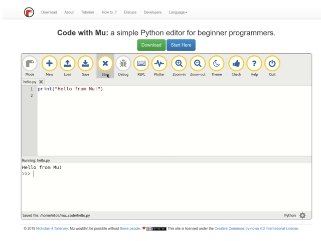
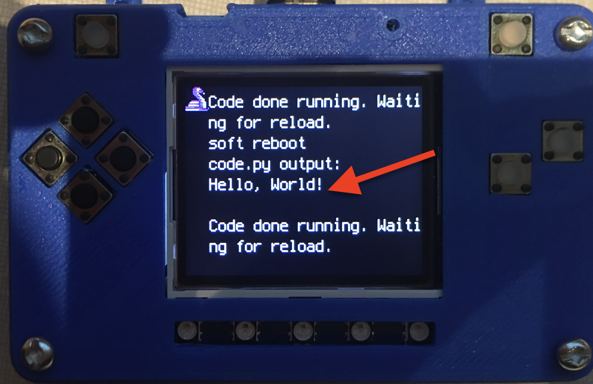

Your IDE
========

One of the great things about CircuitPython hardware is that it just automatically shows up as a USB drive when you attach it to your computer. This means that you can access and save your code using any text editor. This is particularly helpful in schools, where computers are likely to be locked down so students can not load anything. Also students might be using Chromebooks, where only "authorized" Chrome extensions can be loaded.

If you are working on a Chromebook, the easiest way to start coding is to just use the built in `Text app <https://chrome.google.com/webstore/detail/text/mmfbcljfglbokpmkimbfghdkjmjhdgbg?hl=en>`_. As soon as you open or save a file with a *.py extension, it will know it is Python code and automatically start syntax highlighting.  

If you are using a non-Chromebook computer, your best beat for an IDE is Mu. You can get it for Windows, Mac, Raspberry Pi and Linux. It works seamlessly with CircuitPython and the serial consile will give you much needed debugging information. You can download Mu `here <https://codewith.mu/en/download>`_.

Since with CircuitPython devices you are just writing Python files to a USB drive, you are more than welcome to use any IDE that you are familar using.

Hello, World!
-------------

Yes, you know that first program you should always run when starting a new coding adventure! Once you have access to your IDE and you have CircuitPython loaded, you should ensure everything is working before you move on. To do this we will do the traditional "Hello, World!" program. By default CircuitPython looks for a file called code.py in the root directory of the PyBadge to start up. You will place the following code in the code.py file:

.. code-block:: Python

	#!/usr/bin/env python3

	# Created by : Mr. Coxall
	# Created on : October 2019
	# This program prints out your name, using default function parameters

	def full_name(first_name, last_name, middle_name = None):
	    # return the full formal name

	    full_name = first_name
	    if middle_name != None:
	        full_name = full_name + " " + middle_name[0]
	    full_name = full_name + " " + last_name

	    return full_name
	  
	def main():
	    # gets a users name and prints out their formal name
	    middle_name = None
	    
	    first_name = input("Enter your first name: ")
	    question = input("Do you have a middle name? (y/n): ")
	    if question.upper() == "Y" or question.upper() == "YES":
	        middle_name = input("Enter your middle name: ")
	    last_name = input("Enter your last name: ")

	    if middle_name != None:
	        name = full_name(first_name, last_name, middle_name)
	    else:
	        name = full_name(first_name, last_name)

	    print(name)

	if __name__ == "__main__":
	    main()

.. code-block:: python
	:linenos:

	# the Hello, World! program
	print("Hello, World!")

As soon as you save the file onto the PyBadge, the screen should flash and you should see the following:

Congradulations, we are ready to start.