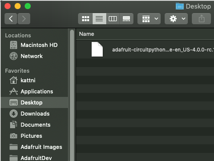

Install CircuitPython
=====================

   Loading CircuitPython UF2 file onto PyBadge

Before doing anything else, you should install the latest version of CircuitPython onto the Pybadge. This ensures you have a clean build with all the latest updates. Adafruit has an excellent quick start guide `here <https://learn.adafruit.com/adafruit-pybadge/installing-circuitpython>`_ to step you through the process of getting the latest build onto your PyBadge. Adafruit also have a more detailed comprehensive version of all the steps with complete explinations `here <https://learn.adafruit.com/welcome-to-circuitpython/installing-circuitpython>`_ you can use, if this is your first time loading CircuitPython onto your PyBadge. 

Just a reminder, if you are having any problems loading CircuitPython onto your PyBadge, ensure that you are using a USB cable that not only provides power, but also provides a data link. Many USB cables you buy are only for charging, not transfering data as well. Once the CircuitPython is all loaded, come on back to continue the tutorial.